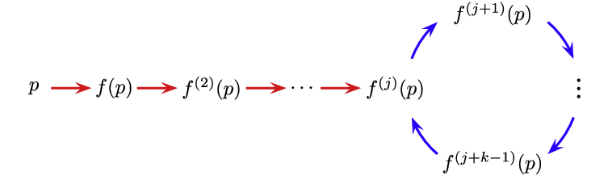

# Find all preperiodic points of Dynamics System over function fields
 
The goal of the project is to find pre-periodic points of a dynamic system defined over function fields by implementing the Hutz algorithm in the open-source environment "Sage" based on the Python language, using algebraic and arithmetic properties of the function field to calculate the pre-periodic points more efficiently and fast.   
By using the algorithm we want to get a list of graphs of periodic points similar to the Poonen hypothesis.
 

**HUTZ algorithm** : https://arxiv.org/pdf/1210.6246.pdf ,
**Poonen hypothesis** : https://arxiv.org/pdf/math/9512217.pdf

 

In the **test** folder there's Jupyter Notebook file which has some python code to test the functions we added to Sage ,we put the functions we wrote at the start of the file and after that we runed this functions on some dynamic systems we chose to show the graphs of the pre-periodic points.  

In the **images** folder there's some pictures of the graphs we got after runnig the algorithm on a number of **Dynamic Systems** defined over **Function Fields** over 
**Finite Field** .

 

**Graph of pre-periodic points :** 
 

